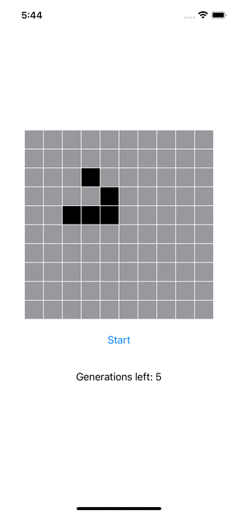
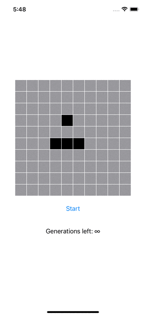

# GameOfLife

The Game of Life is a cellular automaton. It is a zero-player game, meaning that its evolution is determined by its initial state, requiring no further input. One interacts with the Game of Life by creating an initial configuration and observing how it evolves.




You can easily run these 2 examples above ☝️ by doing (in the `GameOfLifeApp`):
```swift
Game(configuration: .default, generations: .finite(5))
```
or
```swift
Game(configuration: .infinite, generations: .infinite)
```

## Architecture

I tried to follow closely the SOLID / DRY / KISS / YouNameIt principles.

The business logic is in a separate module to keep code well separated from the UI logic.
Thus, we can easily test the business logic without caring about the UI and we can also easily change the 
UI (text/UIKit/SwiftUI).

Each unit of code has a single responsibility:
- Modules are either responsible for business logic or UI logic but never both
- Each struct takes care of a single responsibility (with less dependency as possible)
- Each function is about doing one simple thing (again, with less dependency as possible)

This allows to easily test the code (which in this case, is heavily tested).

## Flow

The flow is quite simple, it starts with a `Game` that holds a `Grid` composed of `Cells` that can either 
be `.dead` or `.live`.

Apart from that, a `Game` can be run for a certain amount of `Generations`.

A `Grid` have a `Size` and any of the `Cell` in the `Grid` can be access via its `Point` (`let cell = grid[point]`).

A `Game` is initiated with a `Configuration` that holds the grid size and the initial `livePoints` (aka seed).

## Adaptability

The exercise states that the grid should be of size 10x10 and the game should run 5 generations.

To make sure the code can easily adapt to potential changes, it allows a `Game` to be initiated with:
- A `Configuration` which holds a `Size` that can be:
	- Any other size
	- A square or even a rectangle
- A `Generations` which can be:
	- A `finite` amount of generations for the game to run
	- An `infinite` loop so the game can run forever

A `Configuration` can be created with any type of seed.

We could also quickly and easily create a history containing all the generations inside the `Game`.

---

Side note: the UI was not important but I decided to use SwiftUI as a personal challenge because:
- I’m currently learning about it
- It allows to have some decent UI very quickly and easily
